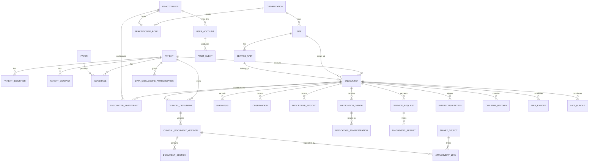
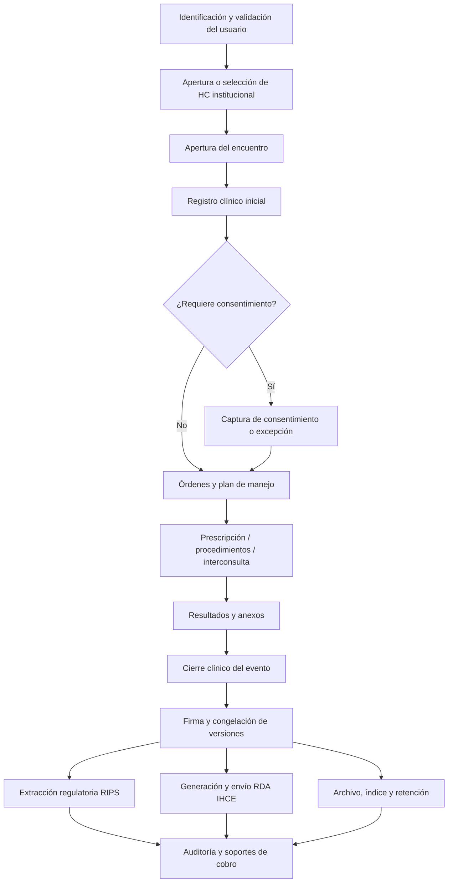

# Especificación de desarrollo para una historia clínica electrónica conforme con la normativa colombiana

## Resumen ejecutivo

Este informe propone una especificación de desarrollo para una historia clínica electrónica con foco primario en cumplimiento normativo colombiano, estabilidad del modelo de datos y trazabilidad jurídica. El alcance cubre el núcleo regulatorio aplicable al registro clínico, custodia, interoperabilidad, prescripción, consentimiento, auditoría, protección de datos, conservación documental y reportes obligatorios; además, traduce esas exigencias en requisitos funcionales y no funcionales, una arquitectura lógica de backend, un modelo de datos relacional, reglas de negocio, interfaces de interoperabilidad, vistas mínimas de frontend, plan de migración, respaldo, pruebas y gestión de riesgos. citeturn7view0turn16view0turn33view4turn13view1turn14view0turn36view0turn9view3

La conclusión central es que un EMR colombiano no puede diseñarse como un simple repositorio de notas médicas. Debe operar, al mismo tiempo, como expediente clínico reservado y cronológico; sistema de soporte a la atención; fuente primaria de RIPS; emisor o proveedor de resúmenes interoperables IHCE/RDA; repositorio probatorio con corrección trazable y sin sobrescritura silenciosa; y archivo con custodia, retención y acceso restringido. La historia clínica sigue siendo privada, obligatoria y sometida a reserva; el prestador conserva su guarda y custodia, incluso dentro del modelo interoperable; y el paciente mantiene derechos reforzados de acceso, copia y control sobre autorizaciones a terceros. citeturn18search0turn7view0turn33view5turn33view0turn16view0turn17view0

Desde la perspectiva de diseño, eso obliga a cinco decisiones estructurales: canon local de datos relacional y estable; versionado inmutable de registros clínicos; auditoría de lectura y escritura; capa explícita de consentimiento y autorización de divulgación separada del consentimiento asistencial; y adaptadores normativos desacoplados para IHCE, RIPS, facturación y vigilancia. En interoperabilidad, las fuentes oficiales revisadas muestran que el mecanismo nacional vigente está orientado a HL7 FHIR mediante RDA y documentos clínicos, no a un intercambio libre y ad hoc entre sistemas. citeturn25view2turn23view5turn14view0turn36view0turn24view3turn28view0

No se especificó volumen de usuarios ni metas de rendimiento; por tanto, este documento asume una institución de tamaño mediano y deja el dimensionamiento de capacidad como variable de implementación. Aun así, la especificación se formula para soportar continuidad operativa, respaldo, crecimiento modular y controles de cumplimiento desde el diseño.

## Marco regulatorio colombiano

La siguiente matriz sintetiza las fuentes oficiales que delimitan el cumplimiento exigible a un EMR en Colombia y la forma en que esas normas se traducen en diseño de software clínico. citeturn18search0turn19view0turn7view0turn6search4turn16view0turn17view0turn29view1turn23view5turn33view4turn13view1turn14view0turn36view0turn9view3turn9view4turn5view6turn5view7turn27view0turn27view1turn24view1turn21view0turn22search10turn32search2turn31view0turn31view1

| Norma o fuente | Mandato principal | Implicación directa para el EMR |
|---|---|---|
| Ley 23 de 1981 y Decreto 3380 de 1981 | La historia clínica es registro obligatorio, privado y reservado; el médico debe dejar constancia de la advertencia del riesgo; el certificado médico tiene contenido mínimo. | El sistema debe tratar la HC como expediente reservado, registrar advertencias de riesgo y producir certificados/incapacidades con estructura verificable. |
| Resolución 1995 de 1999 | Define historia clínica, características de integralidad, secuencialidad, disponibilidad y oportunidad; identifica componentes mínimos; fija reglas de diligenciamiento, acceso, archivo y medios técnicos. | Necesidad de historia única institucional, autor/fecha/hora, anexos, archivo único, control de préstamo, acceso limitado y mecanismos que impidan modificar registros ya guardados. |
| Resolución 839 de 2017 | Modifica la retención y disposición final de historias clínicas. | La política documental debe parametrizar retención mínima de 15 años desde la última atención, con fases archivísticas separadas. |
| Ley 1751 de 2015 y Decreto 2106 de 2019 | Reconocen el derecho del paciente a confidencialidad, consulta y copia gratuita de la HC; fijan entrega de copia en máximo 5 días calendario y permiten remisión electrónica autorizada. | Deben existir funciones de autoservicio o atención de solicitudes, exportación íntegra y trazable, y mecanismo formal de entrega electrónica. |
| Decreto 780 de 2016 y Resolución 3100 de 2019 | Regulan SOGCS, habilitación y estándares exigibles; para historia clínica y registros exigen claridad, oportunidad, custodia, confidencialidad y consentimiento documentado. | El EMR no es accesorio: es parte del cumplimiento de habilitación y debe soportar evidencia auditable de historia clínica, consentimiento y conservación. |
| Ley 2015 de 2020 | Crea la HCE interoperable; obliga a diligenciar y disponer datos, documentos y expedientes en la plataforma que disponga el Gobierno; mantiene custodia local; prohíbe modificar sin dejar rastro; exige plan de seguridad y continuidad. | El modelo debe separar “custodia local” de “interoperabilidad nacional”, soportar corrección por adición, y disponer seguridad, continuidad y trazabilidad. |
| Resolución 866 de 2021 | Reglamenta el conjunto de elementos de datos clínicos relevantes y sus catálogos; fija principios de confidencialidad, disponibilidad, integridad, intercambio, oportunidad, seguridad, uniformidad y veracidad; declara obligatoria la fuente clínica para interoperabilidad. | Debe existir modelo canónico de datos clínicos con catálogos administrables, sin alteración local arbitraria de semántica. |
| Resolución 1888 de 2025 y manual operativo IHCE vigente de febrero de 2026 | Adopta el RDA, define mecanismo nacional de implementación, exige ajustes de los sistemas de información, establece transitoriedad de seis meses desde el 15 de octubre de 2025 y detalla intercambio por API/FHIR, autenticación, RBAC, cifrado y monitoreo. | Toda nueva especificación debe nacer “IHCE-ready”: generar y consultar RDA, validar profesionales/sedes, auditar operaciones y proteger credenciales e intercambios. |
| Ley 1581 de 2012 y Decreto 1377 de 2013 | Los datos de salud son sensibles; el tratamiento requiere base legal, finalidades informadas, seguridad, confidencialidad, prueba de autorización cuando aplique y manejo restringido. | La autorización de datos personales no puede confundirse con el consentimiento clínico; deben existir políticas, trazas, controles de circulación y proceso de incidentes. |
| Ley 527 de 1999, Decreto 2364 de 2012 y definiciones de la Resolución 3100 de 2019 | Reconocen mensajes de datos, firma digital y firma electrónica; la regulación sectorial remite a estas nociones. | El EMR debe soportar identidad fuerte del autor, firma/evidencia de aprobación y no repudio proporcional al acto clínico y al intercambio. |
| Ley 594 de 2000 y Acuerdos AGN 002 de 2014 y 003 de 2015 | Regulan gestión documental, expedientes electrónicos, foliación, índice electrónico, cierre, integridad y preservación. | El expediente electrónico debe tener cierre, índice, metadatos, trazabilidad documental y preservación a largo plazo. |
| Decreto 441 de 2022, Resolución 2284 de 2023 y Resolución 2275 de 2023 | Obligan acceso electrónico a HC para auditoría por entidades responsables de pago; fijan soportes de cobro y RIPS como soporte obligatorio de factura; RIPS se transmite en JSON y toma como fuente, entre otras, la HC. | Se requiere módulo de acceso controlado para auditoría, exportación de soportes y generador/validador de RIPS desacoplado del núcleo clínico. |
| Decreto 2200 de 2005 y Resolución 1403 de 2007 | La prescripción debe estar escrita, con evaluación previa, diagnóstico en HC, denominación común internacional y contenido mínimo; la gestión farmacéutica incluye farmacovigilancia. | El módulo de prescripción debe bloquear órdenes incompletas y conservar correlación prescripción–dispensación–administración. |
| Fuentes entity["organization","INVIMA","autoridad sanitaria Colombia"] y Resolución 4816 de 2008 | Tecnovigilancia y vigilancia de incidentes con dispositivos médicos; farmacovigilancia institucional. | El EMR debe capturar eventos adversos, lotes, dispositivos y reportes regulatorios cuando la IPS participe en estos procesos. |
| Decreto 3518 de 2006 y lineamientos de vigilancia | Crea el SIVIGILA y regula la notificación de eventos de interés en salud pública. | El EMR debe extraer o alimentar notificaciones obligatorias a vigilancia cuando el evento clínico lo exija. |
| Resolución 1442 de 2024 y Resolución 2641 de 2024 | Adoptan CIE-11 con transición desde CIE-10 y establecen CUPS vigente. | El modelo debe parametrizar catálogos diagnósticos y procedimentales, soportar histórico CIE-10/CIE-11 y evitar hardcode de terminologías. |

Normativamente, el núcleo duro del diseño está en cuatro capas que se superponen. La primera es la clínica-documental: Ley 23, Decreto 3380 y Resolución 1995. La segunda es la calidad-habilitación: Decreto 780 y Resolución 3100. La tercera es la interoperabilidad nacional: Ley 2015, Resoluciones 866 y 1888, con lineamientos operativos vigentes del ministerio. La cuarta es la protección de datos y firma: Ley 1581, Decreto 1377, Ley 527 y Decreto 2364. Un EMR que falle en cualquiera de esas capas puede ser funcional desde lo asistencial, pero jurídicamente insuficiente. citeturn18search0turn7view0turn29view1turn23view5turn33view4turn13view1turn14view0turn36view0turn9view3turn5view6turn5view7

También es importante distinguir dos figuras que en la práctica suelen mezclarse indebidamente. El consentimiento informado clínico documenta la aceptación o rechazo libre, voluntario y consciente de un acto asistencial y debe explicar beneficios, riesgos, alternativas e implicaciones; la autorización de tratamiento de datos sensibles atiende a las reglas de hábeas data y sus excepciones. Son procesos relacionados, pero jurídicamente distintos, por lo que el modelo de datos y la interfaz de usuario deben separarlos. citeturn23view1turn16view0turn9view2turn9view4

A la fecha de este informe, la Resolución 1888 de 2025 ya había fijado un plazo máximo de seis meses, contados desde el 15 de octubre de 2025, para integrar e interoperar los sistemas con el modelo IHCE. Por eso, una especificación nueva debe presumir exigibilidad operativa de la capa de interoperabilidad clínica, aun cuando la adopción territorial pueda madurar de forma progresiva. citeturn14view1turn15view3turn36view0

## Requisitos de solución

Los requisitos siguientes traducen el marco anterior a condiciones verificables de producto. No son una lista “deseable”; representan el mínimo razonable para que el EMR pueda sostenerse frente a diligenciamiento, habilitación, custodia, interoperabilidad, acceso del paciente, auditoría, reserva y reporte regulatorio. citeturn7view0turn23view5turn33view0turn34view0turn24view3turn36view0

| Categoría | Requisito mínimo | Evidencia de aceptación |
|---|---|---|
| Identificación del paciente | Apertura de HC por primera atención; historia única institucional; soporte de múltiples identificadores y reclasificación documental sin perder trazabilidad. | No existen dos historias activas institucionales para el mismo paciente sin enlace maestro; cada cambio de identificación conserva historial. |
| Registro clínico | Notas cronológicas, claras, fechadas, con hora, autor identificable y relación con el evento de atención. | Toda nota firmada tiene autor, fecha, hora, servicio, encuentro y estado. |
| Inmutabilidad | Prohibición de sobrescritura silenciosa una vez el registro quede guardado o firmado; corrección por adición/versionado. | Una corrección genera nueva versión, conserva la anterior y expone motivo de cambio. |
| Consentimiento informado | Captura documental de aceptación/rechazo por paciente o responsable, asociada al procedimiento. | No se puede cerrar un procedimiento catalogado como consentible sin documento válido o excepción registrada. |
| Protección de datos | Políticas de finalidad, acceso restringido, trazabilidad, manejo de datos sensibles y gestión de incidentes. | Todo acceso de lectura y exportación queda auditado; el sistema diferencia acceso asistencial de administrativo. |
| Acceso del paciente | Consulta y copia gratuita por medio electrónico, completa y rápida; gestión de solicitudes formales. | Exportación integral verificable, con trazabilidad de solicitud, entrega y acuse. |
| Prescripción | Orden escrita o electrónica con requisitos mínimos, denominación común internacional, diagnóstico y firma del prescriptor. | El sistema bloquea prescripciones con omisiones o abreviaturas prohibidas. |
| Órdenes y resultados | Vinculación entre orden, ejecución, resultado y anexo; soporte de laboratorio, imágenes y procedimientos. | Cada resultado queda trazado a una orden, un encuentro y un profesional responsable. |
| Interoperabilidad | Capacidad de mapear el conjunto de datos relevantes y generar información para RIPS e IHCE/RDA. | Exportación RIPS consistente con la HC y generación de RDA validable. |
| Archivo y retención | Aplicación de tablas de retención, archivo único, cierre e índice del expediente electrónico. | El expediente tiene estado abierto/cerrado, índice electrónico y regla de conservación asignada. |
| Seguridad | Cifrado en tránsito y en reposo, autenticación robusta, RBAC, revocación y continuidad. | Usuarios inactivos o desvinculados pierden acceso inmediatamente; restauración de respaldo probada. |
| Auditoría y trazabilidad | Registro inmutable de eventos de lectura, creación, modificación, firma, exportación y divulgación. | Existe bitácora consultable por episodio, paciente, usuario, IP/canal y acción. |

La matriz RBAC siguiente es una propuesta de mínimos. Su justificación no es organizacional sino jurídica: la historia clínica sólo puede circular dentro de fines legalmente procedentes, el acceso debe ser restringido y la interoperabilidad nacional exige roles documentados y revocación oportuna. citeturn7view0turn9view3turn15view0turn36view0

| Rol propuesto | Leer HC | Crear nota | Firmar nota | Prescribir | Ver anexos | Exportar copia al paciente | Acceso masivo/auditoría |
|---|---:|---:|---:|---:|---:|---:|---:|
| Médico tratante | Sí | Sí | Sí | Sí | Sí | Condicionado | No |
| Enfermería | Sí | Sí | Sí | No | Sí | No | No |
| Farmacia | Parcial | No | No | Verifica/dispensa | Parcial | No | No |
| Laboratorio | Parcial | Resultado | Sí | No | Sí | No | No |
| Imágenes diagnósticas | Parcial | Informe | Sí | No | Sí | No | No |
| Referencia y contrarreferencia | Parcial | Sí | Sí | No | Parcial | No | No |
| Archivo clínico | Metadatos + entrega | No | No | No | Custodia | Sí, por flujo formal | No |
| Facturación/RIPS | Mínimo necesario | No | No | No | Administrativos/soportes | No | No |
| Auditor clínico interno | Condicionado | No | No | No | Sí | No | Sí, por caso |
| Entidad responsable de pago | Acceso externo restringido por acuerdo y auditoría | No | No | No | Soportes auditables | No | Sí, sólo finalidad pactada |
| Paciente/portal | Sí, sobre su información | No | No | No | Sí, si procede | Sí | No |
| Administrador de seguridad | Metadatos operativos | No | No | No | No | No | No |

En el modelo funcional conviene separar claramente tres entidades documentales: **registro clínico asistencial**, **consentimiento informado** y **autorización de tratamiento/divulgación de datos**. La primera documenta atención; la segunda habilita un acto asistencial; la tercera habilita ciertos tratamientos o revelaciones de datos, salvo excepciones legales como urgencia médica o sanitaria, autoridades competentes o transferencia médica necesaria para la atención. citeturn23view1turn9view2turn9view4

## Backend y contratos API

La arquitectura lógica recomendada es **modular, orientada a dominios y desacoplada por responsabilidades regulatorias**. La razón no es meramente técnica: la ley colombiana mantiene la custodia de la historia en el prestador que la genera, mientras la interoperabilidad nacional exige exponer subconjuntos estandarizados para intercambio, no trasladar el expediente operativo completo como modelo interno. citeturn33view5turn14view0turn36view0

| Servicio lógico | Responsabilidad principal | Frontera regulatoria que resuelve |
|---|---|---|
| Identidad clínica y MPI | Paciente, identificadores, responsables, contacto, afiliación | Historia única, identificación del usuario, coherencia intersede |
| Prestador y talento humano | Organización, sede, servicio, profesionales, roles | REPS, RETHUS, firma/autoría |
| IAM y sesiones | Autenticación, autorización, revocación, sesiones activas, elevación de privilegio | Reserva, RBAC, revocación inmediata, acceso restringido |
| Encuentros asistenciales | Admisión, triage, consulta, urgencia, hospitalización, egreso | Cronología clínica, oportunidad, continuidad |
| Documentación clínica | Notas, diagnósticos, antecedentes, signos, epicrisis, correcciones | Diligenciamiento clínico, inmutabilidad, autenticidad |
| Consentimientos y divulgaciones | Consentimiento informado; autorizaciones de terceros; revocatorias | Distinción acto asistencial vs datos personales |
| Órdenes y prescripciones | Órdenes médicas, prescripción, administración, seguimiento | Decreto 2200/2005, servicio farmacéutico, trazabilidad |
| Resultados y anexos | Laboratorio, imágenes, PDF, documentos firmados, metadatos | Anexos de HC, imágenes diagnósticas, soporte técnico-científico |
| Interconsultas y remisiones | Referencia, contrarreferencia, juntas, interconsultas | Continuidad asistencial, articulación entre prestadores |
| Incapacidades y certificados | Certificados médicos, incapacidades, constancias | Contenido mínimo documentable y firma del profesional |
| RIPS y soporte de cobro | Extracción, validación, generación y envío de RIPS; preparación de soportes | Resolución 2275/2023, 2284/2023 y auditoría pagador-prestador |
| Interoperabilidad IHCE | Transformación de datos clínicos relevantes a RDA/FHIR y consulta de documentos externos | Ley 2015/2020, Resolución 866/2021, 1888/2025 |
| Auditoría y cumplimiento | Logs, evidencias, alertas, consultas de acceso, legal hold | Trazabilidad, inspección, incidentes, reserva |
| Gestión documental y conservación | Cierre de expediente, índice, retención, disposición final, preservación | Ley 594/2000, AGN, Resolución 839/2017 |
| Reportes regulatorios | SIVIGILA, farmacovigilancia, tecnovigilancia, indicadores | Decreto 3518/2006, 1403/2007, 4816/2008 |

En autenticación y sesiones, la recomendación es separar tres planos: autenticación humana, autenticación de sistema a sistema y firma clínica. Para usuarios humanos, el EMR debe imponer identidad inequívoca, RBAC, revocación inmediata al terminar la relación laboral y autenticación reforzada para actos de alto riesgo como firma de notas, prescripción, exportaciones masivas o divulgación a terceros. Para integraciones con IHCE, las fuentes oficiales revisadas ya suponen credenciales de cliente, token de acceso, rotación de secretos, transporte cifrado y controles documentados de acceso. citeturn14view4turn15view5turn36view0

En firma, el sistema debe poder demostrar **autoría, aprobación del contenido, integridad del mensaje y no repudio proporcional**. La regulación general reconoce firma en mensajes de datos, firma electrónica y firma digital; la regulación sectorial de habilitación define ambas figuras y la Ley 2015 caracteriza la HCE como información refrendada con firma digital del profesional tratante. Por prudencia de cumplimiento, el diseño debería soportar: evidencia fuerte de firma/equivalente en todos los actos clínicos relevantes; y capacidad de firma digital para documentos o intercambios donde la institución o el mecanismo nacional la exijan de manera expresa. citeturn5view6turn5view7turn25view0turn25view1turn25view3turn15view2

La siguiente propuesta de contratos API internos busca estabilidad del dominio y reduce el acoplamiento a normas cambiantes. Los payloads exactos deben versionarse; el núcleo no debe depender del formato externo de RIPS ni de la guía HL7 FHIR del momento. 

| Método y ruta | Finalidad | Campos mínimos de entrada |
|---|---|---|
| `POST /patients` | Crear o reconciliar paciente | identificadores, nombres, sexo biológico, fecha de nacimiento, residencia, contacto, asegurador |
| `POST /encounters` | Apertura de atención | `patient_id`, tipo de atención, fecha/hora inicio, modalidad, sede, servicio, motivo |
| `POST /clinical-documents` | Crear documento clínico | `encounter_id`, tipo documental, autor, cuerpo estructurado, diagnósticos, plan |
| `POST /clinical-documents/{id}/sign` | Cerrar y firmar versión | `signature_context`, `signer_id`, fecha/hora |
| `POST /consents` | Registrar consentimiento informado | paciente, responsable, procedimiento, riesgos, beneficios, alternativas, decisión |
| `POST /data-disclosures` | Autorizar acceso/divulgación a terceros | titular, tercero, finalidad, alcance, vigencia, base legal |
| `POST /orders` | Crear órdenes médicas | encuentro, servicio solicitado, prioridad, indicaciones |
| `POST /prescriptions` | Prescribir medicamento | prescriptor, paciente, HC, diagnóstico, DCI, forma, dosis, vía, frecuencia, duración |
| `POST /referrals` | Interconsulta o remisión | origen, destino, motivo, prioridad, resumen clínico |
| `POST /incapacity-certificates` | Certificado/incapacidad | paciente, concepto, fechas, profesional, destinatario |
| `POST /attachments` | Adjuntar PDF/imágenes | entidad destino, tipo, hash, metadatos, clasificación documental |
| `POST /rips/exports` | Generar lote RIPS | rango, encuentro(s), pagador, contrato, tipo de envío |
| `POST /ihce/rda` | Generar y encolar RDA | encuentro, paciente, profesional, sede, bundle canónico |
| `GET /audit-events` | Consultar trazas | filtros por paciente, usuario, acción, rango, resultado |

## Modelo de datos relacional

El modelo relacional debe priorizar **normalización para datos maestros** y **versionado inmutable para contenido clínico**. En otras palabras: 3FN para paciente, profesionales, organizaciones, catálogos y relaciones; y tablas de versión para notas, consentimientos y documentos de intercambio, porque la ley exige que la corrección no suprima la información anterior y que toda modificación quede registrada con fecha, hora, nombre e identificación de quien corrige. citeturn33view0turn23view5turn25view2

Los tipos sugeridos pueden mantenerse neutrales al motor relacional: `UUID`, `BIGINT`, `VARCHAR(n)`, `TEXT`, `DATE`, `TIMESTAMP WITH TIME ZONE`, `BOOLEAN`, `NUMERIC`, `JSON`. La estabilidad del modelo depende más de **claves y restricciones** que del motor concreto.

La siguiente matriz describe el núcleo relacional propuesto. Es deliberadamente conservadora: privilegia un inventario de tablas estables y accesorios parametrizados antes que un esquema excesivamente “inteligente” difícil de auditar y conservar.

| Tabla | Campos sugeridos | PK / FK / índices / restricciones |
|---|---|---|
| `organization` | `organization_id`, `name`, `reps_code`, `tax_id`, `status` | PK `organization_id`; UNIQUE `reps_code`; idx `tax_id` |
| `site` | `site_id`, `organization_id`, `site_code`, `name`, `municipality_code`, `address` | PK; FK `organization_id`; UNIQUE (`organization_id`,`site_code`) |
| `service_unit` | `service_unit_id`, `site_id`, `service_code`, `name`, `care_setting` | PK; FK `site_id`; idx (`site_id`,`service_code`) |
| `practitioner` | `practitioner_id`, `document_type`, `document_number`, `full_name`, `rethus_number`, `active` | PK; UNIQUE (`document_type`,`document_number`); idx `rethus_number` |
| `practitioner_role` | `practitioner_role_id`, `practitioner_id`, `organization_id`, `site_id`, `role_code`, `start_at`, `end_at` | PK; FKs; idx (`practitioner_id`,`role_code`,`end_at`) |
| `user_account` | `user_id`, `practitioner_id` nullable, `username`, `status`, `last_login_at` | PK; UNIQUE `username`; FK `practitioner_id` |
| `role` | `role_id`, `code`, `name`, `scope` | PK; UNIQUE `code` |
| `permission` | `permission_id`, `code`, `name` | PK; UNIQUE `code` |
| `user_role` | `user_id`, `role_id`, `site_id`, `effective_from`, `effective_to` | PK compuesta o surrogate; FKs; idx (`user_id`,`effective_to`) |
| `patient` | `patient_id`, `primary_document_type`, `primary_document_number`, `first_name`, `middle_name`, `last_name_1`, `last_name_2`, `birth_date`, `sex_at_birth`, `gender_identity` nullable, `deceased_at` nullable | PK; UNIQUE (`primary_document_type`,`primary_document_number`); idx `birth_date` |
| `patient_identifier` | `patient_identifier_id`, `patient_id`, `identifier_system`, `identifier_type`, `identifier_value`, `is_current` | PK; FK `patient_id`; UNIQUE (`identifier_system`,`identifier_value`) |
| `patient_contact` | `contact_id`, `patient_id`, `contact_type`, `full_name`, `relationship_code`, `phone`, `email`, `address`, `is_primary` | PK; FK; idx (`patient_id`,`is_primary`) |
| `payer` | `payer_id`, `payer_type`, `name`, `code`, `status` | PK; UNIQUE (`payer_type`,`code`) |
| `coverage` | `coverage_id`, `patient_id`, `payer_id`, `affiliate_type`, `policy_number`, `effective_from`, `effective_to` | PK; FKs; idx (`patient_id`,`effective_to`) |
| `encounter` | `encounter_id`, `patient_id`, `site_id`, `service_unit_id`, `encounter_class`, `care_modality`, `admission_source`, `reason_for_visit`, `started_at`, `ended_at`, `status`, `vida_code` nullable | PK; FKs; idx (`patient_id`,`started_at`), (`site_id`,`started_at`) |
| `encounter_participant` | `encounter_participant_id`, `encounter_id`, `practitioner_id`, `participant_role`, `started_at`, `ended_at` | PK; FKs; idx (`encounter_id`,`participant_role`) |
| `clinical_document` | `document_id`, `patient_id`, `encounter_id`, `document_type`, `status`, `current_version_id`, `created_at` | PK; FKs; idx (`patient_id`,`document_type`,`created_at`) |
| `clinical_document_version` | `document_version_id`, `document_id`, `version_no`, `supersedes_version_id`, `author_practitioner_id`, `author_user_id`, `signed_by_user_id`, `signed_at`, `correction_reason`, `payload_json`, `text_rendered`, `hash_sha256`, `is_current` | PK; FKs; UNIQUE (`document_id`,`version_no`); idx (`document_id`,`is_current`); CHECK append-only/payload not null |
| `document_section` | `section_id`, `document_version_id`, `section_code`, `section_order`, `section_payload_json` | PK; FK; UNIQUE (`document_version_id`,`section_code`) |
| `diagnosis` | `diagnosis_id`, `encounter_id`, `document_version_id`, `code_system`, `code`, `description`, `diagnosis_type`, `rank`, `onset_at`, `certainty` | PK; FKs; idx (`encounter_id`,`code_system`,`code`) |
| `allergy_intolerance` | `allergy_id`, `patient_id`, `substance_code`, `code_system`, `criticality`, `reaction_text`, `status`, `recorded_at`, `recorded_by` | PK; FKs; idx (`patient_id`,`status`) |
| `observation` | `observation_id`, `patient_id`, `encounter_id`, `document_version_id`, `observation_type`, `code_system`, `code`, `value_text`, `value_num`, `value_unit`, `observed_at`, `status` | PK; FKs; idx (`encounter_id`,`observation_type`,`observed_at`) |
| `procedure_record` | `procedure_id`, `patient_id`, `encounter_id`, `cups_code`, `description`, `performed_at`, `performer_id`, `status` | PK; FKs; idx (`encounter_id`,`cups_code`) |
| `medication_order` | `medication_order_id`, `patient_id`, `encounter_id`, `diagnosis_id`, `prescriber_id`, `generic_name`, `atc_code` nullable, `dose`, `dose_unit`, `route_code`, `frequency_text`, `duration_text`, `quantity_total`, `valid_until`, `status`, `signed_at` | PK; FKs; idx (`encounter_id`,`prescriber_id`,`signed_at`) |
| `medication_administration` | `med_admin_id`, `medication_order_id`, `administered_at`, `administered_by`, `dose_administered`, `status`, `reason_not_administered` | PK; FK; idx (`medication_order_id`,`administered_at`) |
| `service_request` | `request_id`, `patient_id`, `encounter_id`, `request_type`, `request_code`, `priority`, `requested_by`, `requested_at`, `status` | PK; FKs; idx (`encounter_id`,`request_type`,`status`) |
| `diagnostic_report` | `report_id`, `request_id`, `encounter_id`, `report_type`, `issued_at`, `conclusion_text`, `performer_org_id`, `status` | PK; FKs; idx (`request_id`,`issued_at`) |
| `interconsultation` | `interconsultation_id`, `encounter_id`, `requested_specialty`, `requested_by`, `requested_at`, `reason_text`, `response_document_id`, `status` | PK; FKs; idx (`encounter_id`,`status`) |
| `incapacity_certificate` | `incapacity_id`, `patient_id`, `encounter_id`, `issued_by`, `issued_at`, `start_date`, `end_date`, `concept_text`, `destination_entity`, `signed_at` | PK; FKs; idx (`patient_id`,`issued_at`) |
| `consent_record` | `consent_id`, `patient_id`, `encounter_id`, `consent_type`, `procedure_code` nullable, `decision`, `granted_by_person_id`, `representative_relationship`, `signed_at`, `expires_at`, `document_version_id`, `revoked_at` nullable | PK; FKs; idx (`patient_id`,`consent_type`,`signed_at`) |
| `data_disclosure_authorization` | `authorization_id`, `patient_id`, `third_party_name`, `purpose_code`, `scope_json`, `granted_at`, `expires_at`, `revoked_at`, `legal_basis` | PK; FK; idx (`patient_id`,`expires_at`) |
| `binary_object` | `binary_id`, `storage_locator`, `mime_type`, `size_bytes`, `hash_sha256`, `encrypted_key_ref`, `created_at`, `retention_class` | PK; UNIQUE `hash_sha256`; idx `retention_class` |
| `attachment_link` | `attachment_link_id`, `binary_id`, `linked_entity_type`, `linked_entity_id`, `title`, `classification`, `captured_at` | PK; FK `binary_id`; idx (`linked_entity_type`,`linked_entity_id`) |
| `rips_export` | `rips_export_id`, `payer_id`, `period_from`, `period_to`, `status`, `generated_at`, `payload_json`, `validation_result_json` | PK; FK; idx (`generated_at`,`status`) |
| `ihce_bundle` | `ihce_bundle_id`, `encounter_id`, `bundle_type`, `bundle_json`, `generated_at`, `sent_at`, `response_code`, `vida_code`, `status` | PK; FK; idx (`encounter_id`,`status`) |
| `audit_event` | `audit_id`, `patient_id` nullable, `encounter_id` nullable, `user_id`, `action_code`, `entity_type`, `entity_id`, `occurred_at`, `channel`, `ip_hash`, `result_code`, `reason_code` nullable | PK; idx (`patient_id`,`occurred_at`), (`user_id`,`occurred_at`), (`action_code`,`occurred_at`) |
| `retention_record` | `retention_id`, `entity_type`, `entity_id`, `retention_class`, `trigger_date`, `disposal_eligibility_date`, `legal_hold_flag` | PK; idx (`disposal_eligibility_date`,`legal_hold_flag`) |

Las reglas de integridad más importantes son cuatro. Primero, **unicidad documental y de autoría**: identificadores y firmas no pueden colisionar. Segundo, **append-only clínico**: toda versión firmada debe ser inmutable. Tercero, **consistencia asistencial**: no debe existir medicamento administrado sin orden asociada, ni resultado sin orden o informe. Cuarto, **desacoplamiento regulatorio**: RIPS e IHCE deben salir de vistas o extractos del núcleo clínico, no ser el núcleo mismo. Esto protege el modelo frente a cambios normativos de formato. citeturn7view0turn33view0turn24view3turn36view0

El patrón de historización recomendado es el siguiente: mientras el documento esté en borrador, puede existir una única versión mutable de trabajo; al firmarse, se congela y sólo puede ser corregido por una nueva versión que refiera la anterior mediante `supersedes_version_id`, conserve el hash de la versión previa y registre `correction_reason`, `author`, `signed_at` y `signed_by`. Nunca debe hacerse `UPDATE` destructivo sobre una versión firmada. citeturn33view0turn23view5turn25view2



El diagrama refleja la separación necesaria entre expediente clínico, versionado, anexos, exportaciones regulatorias y auditoría, coherente con las exigencias de reserva, corrección trazable, custodia y generación de subconjuntos interoperables. citeturn7view0turn33view0turn27view0turn24view3turn36view0

En cifrado, la recomendación mínima es doble. **Cifrado en reposo** para toda la base de datos, almacenamiento de objetos y respaldos; y **cifrado a nivel de campo** para observaciones en texto libre, diagnósticos sensibles, salud sexual y reproductiva, salud mental, biometría, identificadores personales, datos de contacto, representaciones de consentimiento, secretos operativos y autorizaciones de divulgación. Las llaves deben administrarse fuera de la base de datos, con rotación y revocación, y los archivos adjuntos deben almacenarse con hash verificable y referencia de llave de cifrado, nunca como blobs sin metadatos. citeturn9view3turn9view5turn34view0turn14view4turn23view5turn36view0

## Reglas de negocio e interoperabilidad

Las reglas de negocio críticas no deben depender sólo de validación en interfaz. Deben existir en el dominio del backend, en la base de datos y en la capa de auditoría. El objetivo es impedir que el sistema reciba información inconsistente o jurídicamente inválida aunque falle un formulario o una integración externa. citeturn7view0turn21view0turn24view3turn36view0

| Regla de negocio | Comportamiento obligatorio |
|---|---|
| Apertura de HC | Si el paciente no tiene HC institucional, el primer encuentro la abre; si existe, se usa la historia vigente. |
| Nota clínica | No puede firmarse sin encuentro, autor, fecha/hora, contenido y servicio. |
| Correcciones | Una nota firmada no se edita; se corrige por nueva versión vinculada a la anterior. |
| Consentimiento | Un procedimiento catalogado como consentible exige consentimiento documentado o causal de excepción registrada. |
| Prescripción | No se guarda si falta diagnóstico, DCI/nombre genérico, forma, vía, dosis, frecuencia, duración, cantidad o firma del prescriptor. |
| Administración de medicamentos | No se administra un medicamento sin orden válida, salvo flujo excepcional auditado de urgencia. |
| Interconsulta | Debe referenciar encuentro origen, problema a resolver, especialidad solicitada y respuesta emitida por profesional competente. |
| Incapacidad/certificado | Debe contener lugar y fecha, paciente, concepto, profesional, registro profesional y firma/evidencia del firmante. |
| Divulgación a terceros | No se exporta HC parcial o total a terceros sin autorización vigente o base legal de excepción. |
| RIPS | El lote se genera desde datos clínicos ya cerrados y conciliados; no se permite “inventar” datos para pasar validación. |
| IHCE/RDA | El bundle se genera al cierre del evento o en el punto de negocio definido; su rechazo no modifica la HC fuente. |
| Auditoría de acceso | Toda lectura clínica sensible, exportación, impresión, firma y consulta externa genera `audit_event`. |

El flujo clínico mínimo debería verse así:



Este flujo responde a la exigencia de oportunidad del registro, consentimiento documentado, firma del autor, trazabilidad de cambios, uso de la HC como fuente de RIPS y generación de intercambios interoperables desde información ya cerrada y consistente. citeturn7view0turn23view5turn21view0turn24view3turn36view0

En interoperabilidad, la postura más segura es un **modelo interno canónico** y mapeos externos versionados. Las fuentes oficiales muestran que la interoperabilidad nacional vigente usa HL7 FHIR, bundles tipo `document`, `Composition` como primera entrada, y consulta/envío de RDA y documentos clínicos. También exige validación de pacientes, profesionales, organizaciones y sedes, además de monitoreo, registro de intentos y trazabilidad del intercambio. citeturn36view0turn15view1

La siguiente tabla propone un mapeo FHIR → tablas internas que mantiene estable el núcleo relacional:

| Recurso FHIR sugerido | Tabla(s) internas | Observación de diseño |
|---|---|---|
| `Patient` | `patient`, `patient_identifier`, `patient_contact` | Soportar múltiples identificadores e histórico de cambios |
| `Coverage` | `coverage`, `payer` | Separar cobertura de demografía |
| `Organization` | `organization` | Usar identificador REPS/habilitación cuando aplique |
| `Location` | `site`, `service_unit` | Sede y unidad de servicio deben distinguirse |
| `Practitioner` | `practitioner` | Validable contra RETHUS si el proceso lo exige |
| `PractitionerRole` | `practitioner_role` | Útil para RBAC y auditoría contextual |
| `Encounter` | `encounter`, `encounter_participant` | Núcleo temporal del episodio |
| `Composition` | `clinical_document`, `clinical_document_version`, `document_section` | Canon humano-jurídico del documento |
| `Condition` | `diagnosis`, parte de `document_section` | Mantener código y texto clínico |
| `AllergyIntolerance` | `allergy_intolerance` | Mejor como entidad longitudinal |
| `Observation` | `observation` | Soporta signos y resultados observacionales |
| `Procedure` | `procedure_record` | Debe relacionarse con CUPS vigente |
| `MedicationRequest` | `medication_order` | Prescripción |
| `MedicationAdministration` | `medication_administration` | Trazabilidad medicamento ordenado–administrado |
| `ServiceRequest` | `service_request` | Paraclínicos, imágenes, consultas |
| `DiagnosticReport` | `diagnostic_report`, `attachment_link` | Informe + anexos |
| `DocumentReference` | `binary_object`, `attachment_link` | PDF, imagen, epicrisis externa |
| `Bundle` | `ihce_bundle` | Persistencia de intercambio, no de negocio interno |

El cuadro siguiente resume un mapeo RIPS → fuente interna que evita duplicidad del dato regulatorio en tablas clínicas primarias. citeturn24view1turn24view3turn24view0

| Segmento RIPS | Fuente recomendada |
|---|---|
| Transacción | `rips_export`, `coverage`, `payer`, contrato/cobro |
| Usuario | `patient`, `patient_identifier`, `coverage`, residencia |
| Consulta | `encounter`, `diagnosis`, `clinical_document_version` |
| Procedimientos | `procedure_record`, `service_request`, `diagnosis` |
| Urgencia con observación | `encounter` con clase/estados específicos + `clinical_document_version` |
| Hospitalización | `encounter` con ingreso/egreso + resumen clínico |
| Recién nacidos | submodelo de paciente y encuentro neonatal |
| Medicamentos | `medication_order`, `medication_administration` |
| Otros servicios | `service_request`, `diagnostic_report`, cargos parametrizados |

Sobre CDA/C-CDA, la recomendación es tratarlos como **capas de compatibilidad de importación/exportación**, no como almacenamiento canónico. Las fuentes oficiales revisadas para interoperabilidad nacional se concentran en FHIR/RDA; por tanto, si una red, laboratorio o tercero aún usa CDA/C-CDA, conviene construir un adaptador que transforme esos documentos al modelo interno y, en sentido de salida, emita CDA/C-CDA sólo cuando el tercero lo requiera contractualmente. citeturn36view0turn35search5

Por catálogos, el diseño debe parametrizar al menos: tipos documentales, sexo biológico, identidad de género cuando aplique, municipios y departamentos, aseguradores, modalidades de atención, CUPS, CIE-10 y CIE-11 históricos, tipos de usuario/pago, rutas de ingreso, estados de documento, tipos de consentimiento y terminologías IHCE. El requisito surge tanto de la estandarización nacional como de la transición diagnóstica reciente y de la necesidad de no recompilar el sistema ante cada cambio de anexo técnico. citeturn13view2turn13view3turn31view0turn31view1

## Frontend, migración y respaldo

Las vistas de frontend deben diseñarse como **superficies de captura regulada**, no sólo como pantallas operativas. Cada una debe exponer campos mínimos normativos y bloquear el cierre si faltan datos exigibles para el tipo de atención. citeturn7view0turn23view5turn21view0turn33view0

| Vista mínima | Elementos obligatorios o casi obligatorios |
|---|---|
| Registro de paciente | nombres y apellidos completos, documento, fecha de nacimiento, edad, sexo, ocupación, dirección, teléfono, residencia, acompañante/responsable, aseguradora, tipo de vinculación |
| Apertura de atención | fecha/hora, modalidad, vía de ingreso, motivo, sede, servicio, profesional responsable |
| Evolución/nota clínica | fecha/hora, profesional, subjetivo/objetivo o equivalente, diagnósticos, plan, firma/evidencia de autoría |
| Consentimiento informado | paciente o representante, procedimiento/intervención, riesgos, beneficios, alternativas, aceptación/rechazo, fecha/hora, firmantes |
| Prescripción | prestador, lugar/fecha, paciente, número de HC, tipo de usuario, nombre genérico, concentración, forma, vía, dosis, frecuencia, duración, cantidad, indicaciones, profesional/firma |
| Órdenes y resultados | solicitante, prioridad, servicio solicitado, fecha/hora, resultado/informe, anexos, responsable |
| Interconsulta/remisión | motivo, especialidad solicitada, urgencia, resumen clínico, respuesta o contrarreferencia |
| Incapacidad/certificado | lugar y fecha, destinatario, objeto, paciente, concepto, profesional, número de registro, firma |
| Visor documental y anexos | metadatos del documento, versión, hash, clasificación, control de descarga, auditoría de visualización |
| Solicitudes del paciente | petición de copia, estado, fecha límite, canal de entrega, constancia de remisión |
| Auditoría y acceso | actor, fecha/hora, acción, motivo, ámbito, resultado |
| Panel regulatorio | estado de RIPS, estado de envío IHCE, rechazos, consentimientos faltantes, firmas pendientes, documentos por cerrar |

Las políticas de migración deben partir de una premisa jurídica: migrar no equivale a “reconstruir” la historia clínica. Si el sistema legado no soporta versionado, firma o metadatos suficientes, el nuevo EMR debe importar esos contenidos como **documentos históricos migrados**, preservando fuente, fecha de origen, hash de ingestión y nivel de confianza, en lugar de presentarlos falsamente como notas nativas del nuevo sistema. Eso reduce el riesgo probatorio y respeta la exigencia de autenticidad e integridad documental. citeturn25view3turn27view0turn27view1

La estrategia recomendada de migración comprende cinco etapas. Primero, inventario y perfilado: HC activas, anexos, catálogos, formatos de fecha, documentos de identidad, CIE/CUPS y calidad de autoría. Segundo, reconciliación maestra: deduplicación con MPI, reglas de precedencia y resolución manual de colisiones. Tercero, migración clínica por capas: pacientes y coberturas; luego encuentros; luego documentos firmados, resultados y anexos; por último RIPS históricos y artefactos regulatorios. Cuarto, validación: conteos de control, hash de archivos, muestreo clínico, conciliación financiera y comparación con reportes legados. Quinto, corte y estabilización: congelamiento del legado, bitácora de incidencias y periodo de doble consulta controlada. citeturn7view0turn24view3turn27view0

En respaldo y continuidad, el EMR debe distinguir entre **backup**, **archivo**, **réplica** y **preservación**. El backup sirve para restaurar operación; el archivo, para cumplir custodia y retención; la réplica, para disponibilidad; y la preservación, para mantener legibilidad e integridad en el tiempo. Jurídicamente, no son equivalentes. La historia clínica debe conservarse al menos 15 años desde la última atención, y la Ley 2015 además exige plan de seguridad, privacidad, continuidad y evaluación periódica de riesgo. citeturn6search4turn34view0turn27view1

Operativamente, recomiendo una política de tres capas: copia operacional frecuente de bases y objetos; almacén de archivo de sólo agregar para expedientes cerrados; y prueba recurrente de restauración con verificación de hash, índices documentales y auditoría. Los logs críticos de acceso y seguridad deben conservarse en un repositorio inmutable y con retención superior a los logs no sensibles, porque son evidencia de cumplimiento y de eventuales investigaciones. citeturn15view4turn36view0

## Pruebas, riesgos y anexos

El plan de pruebas debe unir validación funcional, legal y de interoperabilidad. No basta con que la interfaz “guarde”; debe demostrarse que el sistema registra oportunamente, no sobrescribe, protege reserva, entrega copia al paciente, soporta auditoría, exporta RIPS consistentes y puede integrarse con IHCE sin comprometer la HC fuente. citeturn7view0turn17view0turn24view3turn36view0

| Tipo de prueba | Criterio de aceptación |
|---|---|
| Registro clínico | Una nota firmada conserva autor, fecha/hora, hash y no admite edición destructiva. |
| Correcciones | La corrección crea una nueva versión con referencia a la anterior y motivo obligatorio. |
| Consentimiento | El sistema bloquea el cierre del procedimiento si falta consentimiento o excepción documentada. |
| Prescripción | Se rechaza cualquier fórmula sin diagnóstico, DCI, dosis, vía, frecuencia, duración, cantidad y firma. |
| Acceso y RBAC | Un usuario sin rol asistencial no puede leer detalles clínicos; el intento queda auditado. |
| Copia al paciente | Puede generarse y entregarse por medio electrónico con registro de solicitud, entrega y acuse. |
| Archivo y retención | El expediente cerrado tiene índice, metadatos, retención asignada y queda protegido contra depuración indebida. |
| RIPS | El lote JSON pasa validaciones técnicas y cada dato es trazable a la HC origen. |
| IHCE | El RDA se transforma a Bundle `document`, con `Composition` en primera entrada y referencias válidas. |
| Seguridad | Cifrado en tránsito y reposo verificado; revocación de usuarios desvinculados efectiva; registro de incidentes. |
| Migración | Conteos, hashes y muestras clínicas coinciden con el legado según umbral aprobado por comité clínico-jurídico. |
| Continuidad | Prueba de restauración completa recupera datos, anexos, índices y trazas de auditoría. |

La matriz de riesgos siguiente concentra los principales riesgos regulatorios y la mitigación de diseño/documentación. citeturn9view3turn23view5turn28view0turn24view3turn36view0

| Riesgo | Impacto | Mitigación recomendada |
|---|---|---|
| Sobrescritura de notas o “edición silenciosa” | Invalidez probatoria, no conformidad de habilitación | Versionado append-only, hash por versión, firma y auditoría de correcciones |
| Confusión entre consentimiento clínico y autorización de datos | Tratamiento ilícito de datos o acto clínico no consentido | Flujos y tablas separadas; textos y finalidades diferenciadas |
| Accesos administrativos excesivos | Violación de reserva y sanciones de datos personales | RBAC por finalidad, vistas minimizadas y auditoría de lectura |
| RIPS construido por fuera de la HC | Glosas, rechazo, inconsistencias regulatorias | Generación desde extractos del núcleo clínico cerrado y conciliado |
| Integración IHCE acoplada al modelo interno | Alta fragilidad ante cambios normativos | Adaptador externo versionado y modelo canónico interno |
| Catálogos hardcodeados | Obsolescencia frente a cambios CIE/CUPS/anexos | Catálogo parametrizable con vigencias y equivalencias |
| Migración con pérdida de autoría/origen | Riesgo probatorio y clínico | Ingesta con metadatos de procedencia, hash y marcación de histórico migrado |
| Backup tratado como archivo legal | Incumplimiento de conservación | Separar backup, archivo, réplica y preservación |
| Acceso de pagadores sin mínimo necesario | Exposición innecesaria de datos sensibles | Portal o extracto auditado, con finalidad contractual y alcance restringido |
| Falta de evidencia ante inspección o litigio | Dificultad de defensa jurídica | Bitácoras inmutables, legal hold, expedientes exportables y trazabilidad completa |

Los anexos siguientes son ilustrativos y deben adaptarse al motor relacional, a la política documental institucional y a la guía de interoperabilidad vigente al momento de implementación.

**Anexo de DDL ejemplar.** Este ejemplo materializa el patrón de historia única, documento/versionado y auditoría que mejor se alinea con reserva, autoría, corrección trazable y conservación. citeturn7view0turn33view0turn27view0

```sql
CREATE TABLE patient (
    patient_id UUID PRIMARY KEY,
    primary_document_type VARCHAR(10) NOT NULL,
    primary_document_number VARCHAR(30) NOT NULL,
    first_name VARCHAR(80) NOT NULL,
    middle_name VARCHAR(80),
    last_name_1 VARCHAR(80) NOT NULL,
    last_name_2 VARCHAR(80),
    birth_date DATE NOT NULL,
    sex_at_birth VARCHAR(20) NOT NULL,
    gender_identity VARCHAR(40),
    created_at TIMESTAMP WITH TIME ZONE NOT NULL,
    created_by UUID NOT NULL,
    CONSTRAINT uq_patient_document UNIQUE (primary_document_type, primary_document_number)
);

CREATE TABLE encounter (
    encounter_id UUID PRIMARY KEY,
    patient_id UUID NOT NULL REFERENCES patient(patient_id),
    site_id UUID NOT NULL,
    service_unit_id UUID NOT NULL,
    encounter_class VARCHAR(30) NOT NULL,
    care_modality VARCHAR(30) NOT NULL,
    reason_for_visit TEXT NOT NULL,
    started_at TIMESTAMP WITH TIME ZONE NOT NULL,
    ended_at TIMESTAMP WITH TIME ZONE,
    status VARCHAR(20) NOT NULL,
    created_at TIMESTAMP WITH TIME ZONE NOT NULL,
    created_by UUID NOT NULL
);

CREATE INDEX ix_encounter_patient_started_at
    ON encounter (patient_id, started_at DESC);

CREATE TABLE clinical_document (
    document_id UUID PRIMARY KEY,
    patient_id UUID NOT NULL REFERENCES patient(patient_id),
    encounter_id UUID NOT NULL REFERENCES encounter(encounter_id),
    document_type VARCHAR(40) NOT NULL,
    status VARCHAR(20) NOT NULL,
    current_version_id UUID,
    created_at TIMESTAMP WITH TIME ZONE NOT NULL,
    created_by UUID NOT NULL
);

CREATE TABLE clinical_document_version (
    document_version_id UUID PRIMARY KEY,
    document_id UUID NOT NULL REFERENCES clinical_document(document_id),
    version_no INTEGER NOT NULL,
    supersedes_version_id UUID REFERENCES clinical_document_version(document_version_id),
    author_practitioner_id UUID NOT NULL,
    author_user_id UUID NOT NULL,
    signed_by_user_id UUID,
    signed_at TIMESTAMP WITH TIME ZONE,
    correction_reason TEXT,
    payload_json JSON NOT NULL,
    text_rendered TEXT,
    hash_sha256 VARCHAR(64) NOT NULL,
    is_current BOOLEAN NOT NULL DEFAULT FALSE,
    created_at TIMESTAMP WITH TIME ZONE NOT NULL,
    CONSTRAINT uq_document_version UNIQUE (document_id, version_no)
);

CREATE INDEX ix_document_version_current
    ON clinical_document_version (document_id, is_current);

CREATE TABLE consent_record (
    consent_id UUID PRIMARY KEY,
    patient_id UUID NOT NULL REFERENCES patient(patient_id),
    encounter_id UUID REFERENCES encounter(encounter_id),
    consent_type VARCHAR(40) NOT NULL,
    procedure_code VARCHAR(30),
    decision VARCHAR(20) NOT NULL, -- accepted, rejected, withdrawn
    granted_by_person_name VARCHAR(160) NOT NULL,
    representative_relationship VARCHAR(60),
    signed_at TIMESTAMP WITH TIME ZONE NOT NULL,
    document_version_id UUID REFERENCES clinical_document_version(document_version_id),
    revoked_at TIMESTAMP WITH TIME ZONE
);

CREATE TABLE medication_order (
    medication_order_id UUID PRIMARY KEY,
    patient_id UUID NOT NULL REFERENCES patient(patient_id),
    encounter_id UUID NOT NULL REFERENCES encounter(encounter_id),
    prescriber_id UUID NOT NULL,
    generic_name VARCHAR(255) NOT NULL,
    diagnosis_code VARCHAR(20) NOT NULL,
    diagnosis_code_system VARCHAR(20) NOT NULL,
    concentration VARCHAR(80) NOT NULL,
    dosage_form VARCHAR(80) NOT NULL,
    route_code VARCHAR(30) NOT NULL,
    dose VARCHAR(40) NOT NULL,
    frequency_text VARCHAR(120) NOT NULL,
    duration_text VARCHAR(120) NOT NULL,
    quantity_total VARCHAR(80) NOT NULL,
    indications TEXT,
    signed_at TIMESTAMP WITH TIME ZONE NOT NULL,
    status VARCHAR(20) NOT NULL
);

CREATE TABLE audit_event (
    audit_id BIGINT PRIMARY KEY,
    patient_id UUID,
    encounter_id UUID,
    user_id UUID NOT NULL,
    action_code VARCHAR(40) NOT NULL, -- read, create, sign, export, disclose
    entity_type VARCHAR(40) NOT NULL,
    entity_id UUID,
    occurred_at TIMESTAMP WITH TIME ZONE NOT NULL,
    channel VARCHAR(30) NOT NULL,
    result_code VARCHAR(20) NOT NULL,
    reason_code VARCHAR(40)
);

CREATE INDEX ix_audit_patient_occurred_at
    ON audit_event (patient_id, occurred_at DESC);

CREATE INDEX ix_audit_user_occurred_at
    ON audit_event (user_id, occurred_at DESC);
```

**Anexo de JSON de API interna.** Este ejemplo refleja una creación de documento clínico desacoplada del formato externo de IHCE y compatible con versionado. 

```json
{
  "document_type": "evolucion_medica",
  "patient_id": "7d3a6e22-2c86-4f7c-9b2a-53f73090c911",
  "encounter_id": "1cb09a21-85b2-457f-b7b2-5b0322bc7c98",
  "author_practitioner_id": "d1293a93-cf58-4f65-b443-8db4afc645d1",
  "sections": [
    {
      "code": "motivo_consulta",
      "text": "Dolor abdominal de 12 horas de evolución."
    },
    {
      "code": "examen_fisico",
      "text": "Paciente alerta, abdomen doloroso en FID, sin irritación peritoneal."
    },
    {
      "code": "diagnosticos",
      "entries": [
        {
          "code_system": "CIE-11",
          "code": "DA64",
          "description": "Acute appendicitis",
          "type": "principal"
        }
      ]
    },
    {
      "code": "plan_manejo",
      "text": "Solicitar hemograma, ecografía abdominal y valoración por cirugía general."
    }
  ]
}
```

**Anexo de JSON interoperable tipo FHIR/RDA.** La guía nacional vigente exige bundles `document` con `Composition` en la primera entrada y referencias consistentes. El siguiente ejemplo es sólo un esqueleto de referencia para el mapeo. citeturn36view0

```json
{
  "resourceType": "Bundle",
  "type": "document",
  "entry": [
    {
      "fullUrl": "urn:uuid:composition-1",
      "resource": {
        "resourceType": "Composition",
        "id": "composition-1",
        "status": "final",
        "type": {
          "coding": [
            {
              "system": "http://loinc.org",
              "code": "18842-5",
              "display": "Discharge summary"
            }
          ]
        },
        "subject": { "reference": "Patient/CC-1234567890" },
        "encounter": { "reference": "Encounter/Encounter-0" },
        "date": "2026-04-21T15:45:00-05:00",
        "author": [{ "reference": "Practitioner/CC-987654321" }],
        "title": "Resumen digital de atención",
        "section": [
          {
            "title": "Diagnósticos",
            "entry": [{ "reference": "Condition/Condition-0" }]
          }
        ]
      }
    },
    {
      "fullUrl": "urn:uuid:patient-1",
      "resource": {
        "resourceType": "Patient",
        "id": "CC-1234567890",
        "identifier": [
          {
            "system": "urn:colombia:tipo-documento",
            "value": "CC-1234567890"
          }
        ],
        "name": [{ "family": "Pérez", "given": ["Ana", "María"] }],
        "gender": "female",
        "birthDate": "1990-01-15"
      }
    }
  ]
}